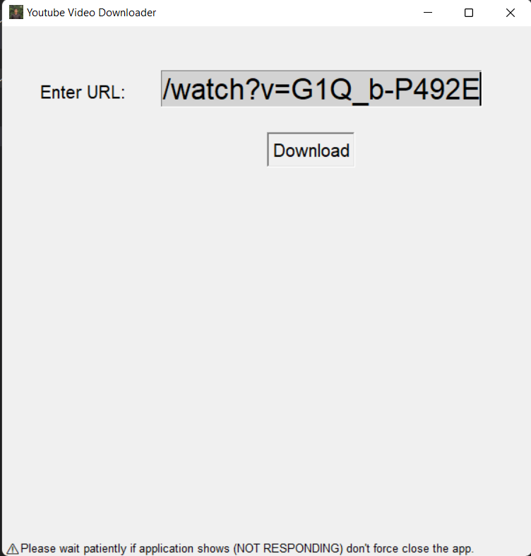
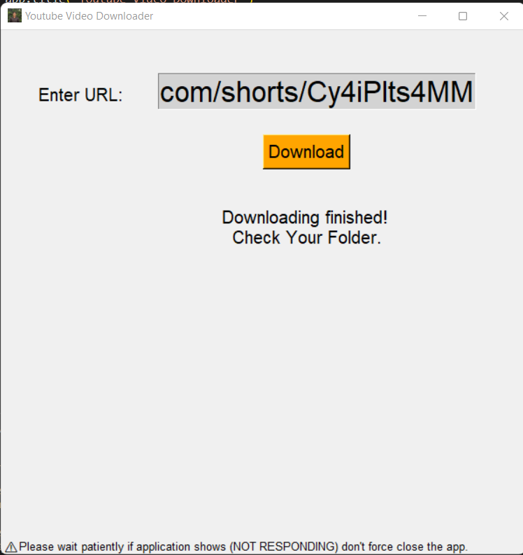

<div align="center">
  <h1 align="center"> Youtube Video Downloader</h1>
</div>

## About Youtube Video Downloader:
This is a Youtube Video Downloader Application made in Python using Tkinter library.

## Screen Shots:
<div align="center">
  
</div>
<div align="center">
  
</div>
<div align="center">
  
</div>


### Steps to Run on Local Machine

***

#### Note: You need to have Python installed in your Local Machine if not, first install it from <a href="https://www.python.org/downloads/windows/">here</a>.
##### Step 1) Clone jontybhalodiya/YT-Video-Downloader.
##### Step 2) Open YT-Video-Downloader Cloned Directory in Command Prompt.
##### Step 3) Run the Following commands to install necessary Libraries:
```
pip install pytube
```
##### Step 4) Open main.py in Visual Studio code and Click Run.

***